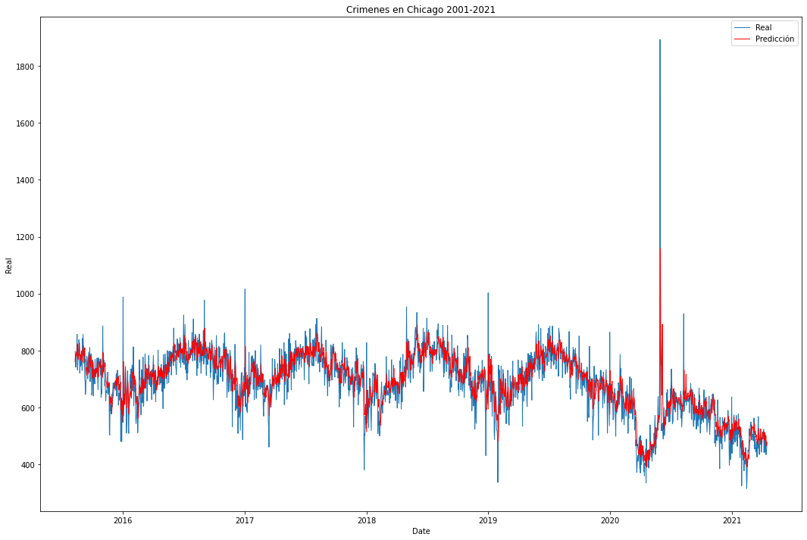

# Bitácora de Experimentos con modelos de Machine Learning
---
## Regresión Lineal
Se probarán 4 instancias de modelos de regresiones lineales para obtener un modelo predictivo sobre los crímenes en chicago, cada una de las instancias tomarán en cuenta una, dos, tres y cuatro semanas previas para hacer la predicción respectivamente.

### Instancia 1:
**Parámetros:**
* Varíables de entradas: 7

**Observaciones:** 
* Al entrenar por primera ve el modelo y probarlo con el dataset de prueba se vió sorprendentemente preciso, la medida $r^2$ fue de 0.9.

