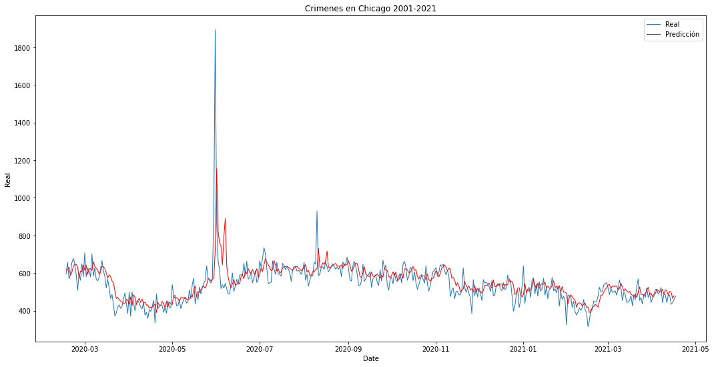

# Bitácora de Experimentos con modelos de Machine Learning
---
## Regresión Lineal
Se probarán 4 instancias de modelos de regresiones lineales para obtener un modelo predictivo sobre los crímenes en chicago, cada una de las instancias tomarán en cuenta una, dos, tres y cuatro semanas previas para hacer la predicción respectivamente.

### Instancia 1:
**Parámetros:**
* Varíables de entradas: 7

**Observaciones:** 
* Al entrenar por primera ve el modelo y probarlo con el dataset de prueba se vió sorprendentemente preciso, la medida $r^2$ fue de 0.9.

*Gráfica obtenida del dataset de prueba.*

* Posteriormente se redujo el periodo de tiempo observado y se obtuvo la siguiente gráfica, se notó que la predicción era una repetición de los datos del día anterior, lo que sugeriría un overfitting.

* Se decidió hacer una predicción pero en vez de proporcionar los datos reales previos como parámetro se fue alimentando el modelo con predicciones pasadas. Esto fue lo que se obtuvo.

* Es evidente que el modelo no predice los crímenes así que se descarta esta instancia.

### Instancia 2:
**Parámetros:**
* Varíables de entradas: 14
**Observaciones**
* Se presentó un comportamiento similar al de la instancia anterior, se decidió no seguir probando con una regresión lineal.

## LSTM
### Instancia 1:
**Parámetros**
* Elementos por muestra : 30
* Capas ocultas: 3 (50,50,50)
* Optimizador : adam
* loss = mean squared error

**Observaciones**
* Para predicción inmediata se tuvo un MSE de 5175 y un r2 de 0.6
* El modelo no predijo con presición los crímenes a mas de 1 dia

### Instancia 2:
**Parámetros**
* Elementos por muestra : 60
* Capas ocultas: 3 (50,50,50)
* Optimizador : adam
* loss = mean squared error
